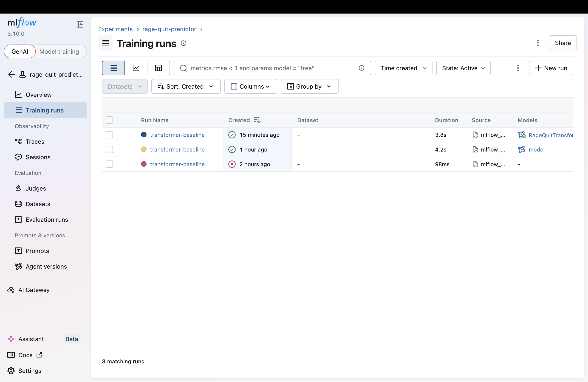
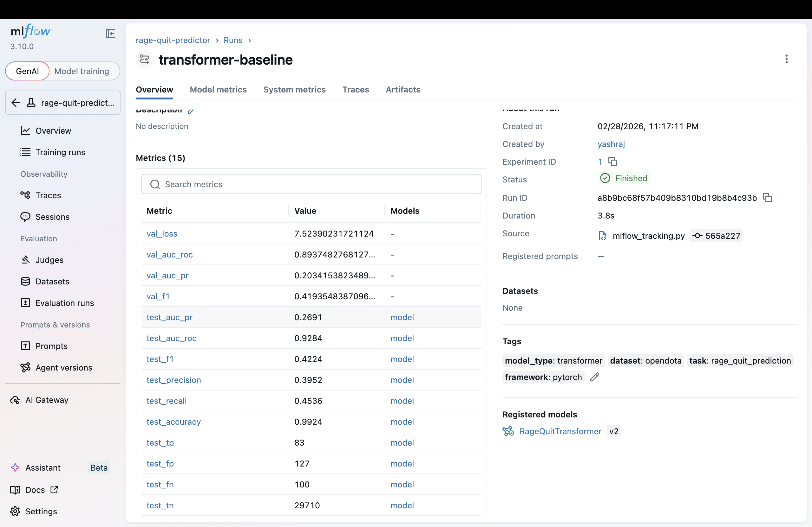
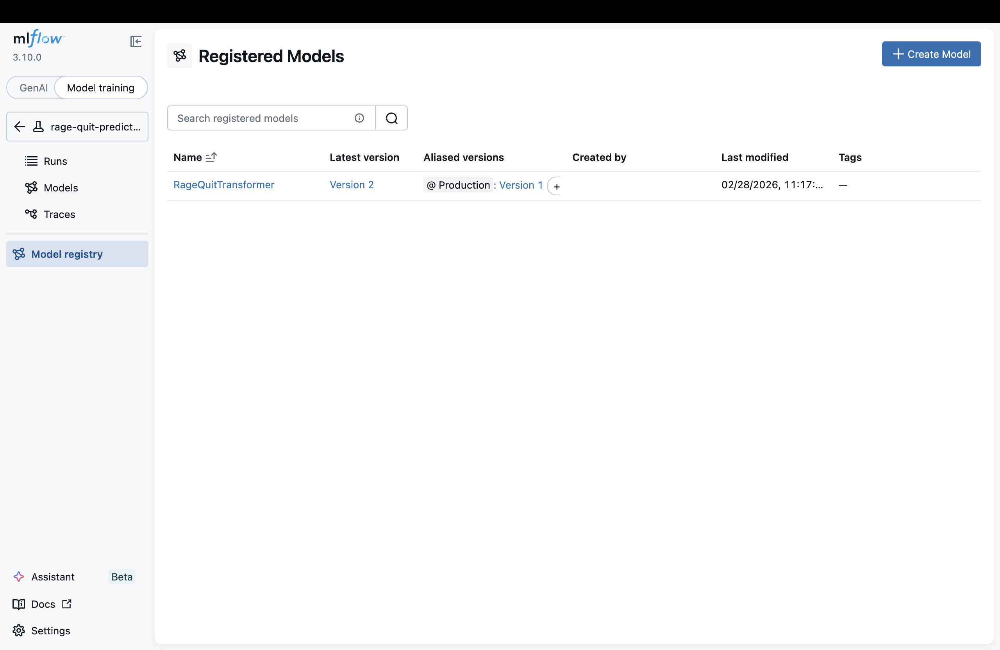
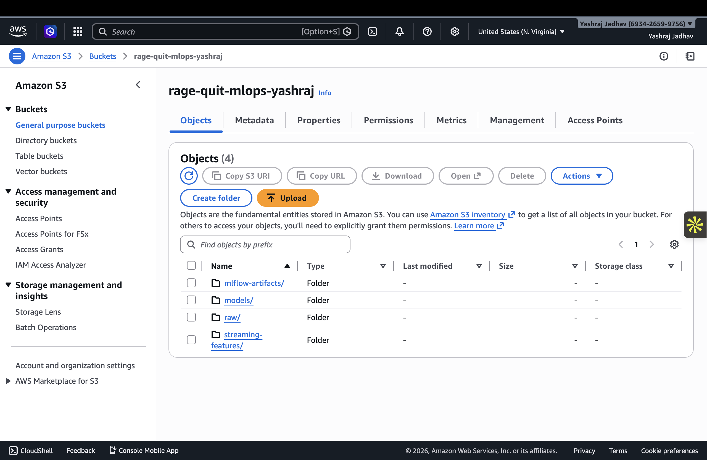
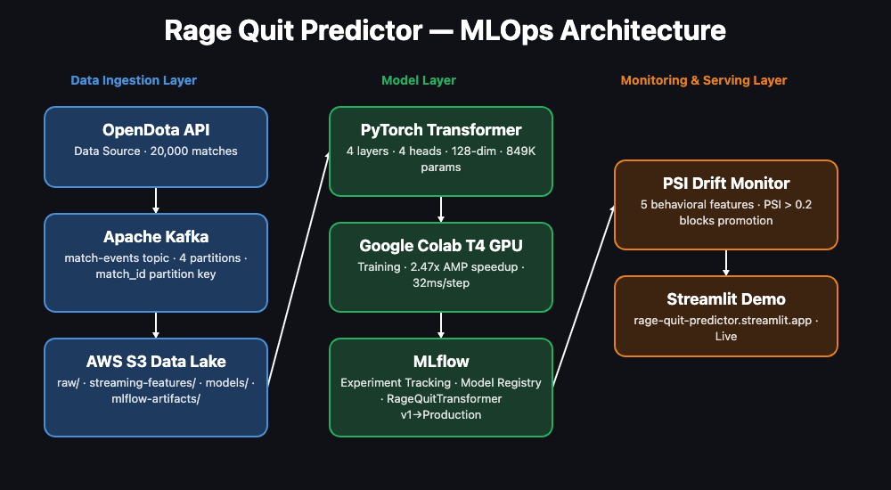

# Rage Quit Predictor

**A custom PyTorch transformer that predicts when a Dota 2 player is about to rage quit — before they leave the match.**

## 🔴 [Live Demo — Streamlit](https://rage-quit-predictor.streamlit.app) &nbsp;|&nbsp; 🤗 [Live Demo — HuggingFace Spaces](https://huggingface.co/spaces/yashraj10/rage-quit-predictor)

> Streamlit app may take ~30s to wake up on first load (free tier).

This is a user retention / churn prediction problem solved with behavioral event sequence modeling. The same architecture generalizes to any product with session-level behavioral data (music listening patterns, ride-request behavior, browsing sessions).

---

## Key Results

| Model | AUC-PR ★ | AUC-ROC | F1 | Precision | Recall |
|-------|----------|---------|------|-----------|--------|
| Logistic Regression | 0.247 | 0.931 | 0.420 | 0.415 | 0.426 |
| XGBoost | 0.268 | 0.914 | 0.395 | 0.422 | 0.372 |
| LSTM | 0.256 | 0.954 | 0.370 | 0.324 | 0.432 |
| **Transformer (ours)** | **0.269** | **0.928** | **0.422** | **0.395** | **0.454** |

Evaluated on 30,020 test sequences · 183 positives · 29,837 negatives · **0.61% positive rate**

**★ AUC-PR is the primary metric.** With a 0.61% positive rate, AUC-ROC is inflated by 29,837 easy negatives. AUC-PR reveals the real precision-recall tradeoff on the minority class — similar to fraud detection or rare disease screening.

**Why the transformer wins:** Not just on aggregate metrics, but on **interpretability**. Attention heatmaps show *which events in which order* predict rage quits — something logistic regression on aggregated features fundamentally cannot do. The model learns that declining performance + disengagement (APM drops + XP deficit) is the strongest quit signal.

---

## MLOps Extension

A production-grade operational layer built around the model — experiment tracking, GPU optimization, cloud storage, event streaming, and drift monitoring.

| Component | Technology | What It Does | Status |
|-----------|-----------|--------------|--------|
| Experiment Tracking | MLflow | Logs all hyperparams, metrics, artifacts per run. Model registry with Staging→Production lifecycle | ✅ Live |
| Mixed Precision | torch.cuda.amp | FP16 forward pass + FP32 gradients. **2.47x training speedup** on T4 GPU | ✅ Benchmarked |
| GPU Profiling | torch.profiler | Identifies linear layers + attention as bottleneck (9.6ms + 7.3ms of 32ms/step) | ✅ Profiled |
| INT8 Quantization | torch.quantization | Partial quantization of classifier + embeddings. Honest result: no benefit without full TransformerEncoder quantization | ✅ Documented |
| Data Lake | AWS S3 | 4-tier bucket: `raw/`, `streaming-features/`, `models/`, `mlflow-artifacts/`. Model weights uploaded | ✅ Live |
| Event Streaming | Apache Kafka | `match-events` topic, 4 partitions (match_id % 4), 100 events produced across 5 simulated matches | ✅ Live |
| Drift Monitoring | PSI (custom) | Population Stability Index across 5 behavioral features. PSI > 0.2 blocks model promotion | ✅ Live |
| Pipeline Orchestration | Apache Airflow | 6-task weekly DAG: ingest → feature engineering → load → train → evaluate → drift check | 📋 Architected |
| Stream Processing | Spark Structured Streaming | Window aggregation on Kafka topic → Parquet → S3 | 📋 Architected |
| Production API | AWS SageMaker | REST inference endpoint with autoscaling, MLflow → SageMaker deployment | 📋 Architected |

### MLOps File Structure
```
mlops/
├── mlflow_tracking.py      # Experiment logging + model registry lifecycle
├── kafka_producer.py       # Match event producer (match_id partitioning)
├── psi_drift_monitor.py    # PSI drift detection across 5 behavioral features
├── s3_data_lake.py         # S3 bucket utilities (upload model, metrics)
└── quantization_results.json  # AMP + INT8 benchmark results
```

### Key MLOps Results
- **2.47x** training speedup with AMP on T4 GPU (80.8ms → 32.8ms per step)
- **Top CUDA bottleneck:** `aten::linear` at 9.6ms (40 calls) — attention projections dominate
- **PSI drift detected:** All 5 features exceed threshold under simulated patch-level shift
- **S3 bucket:** `s3://rage-quit-mlops-yashraj` — model v1 (10MB) + metrics live
- **MLflow:** 2 registered model versions, experiment ID 1, AUC-PR tracked per epoch

### MLOps Screenshots

**MLflow — Training Runs**


**MLflow — Run Metrics (test_auc_pr: 0.2691, linked to git commit 565a227)**


**MLflow — Model Registry (RageQuitTransformer v2, Production: v1)**


**AWS S3 — 4-Tier Data Lake**

---

## Architecture


```
Event Sequence → Token Embedding + Continuous Feature Projection + Game-Time Positional Encoding
    → Transformer Encoder (4 layers, 4 heads, 128-dim)
    → [CLS] token representation
    → Classification Head (128 → 64 → 1) → P(rage_quit)
```

**849,793 parameters · 22 event tokens · 6 continuous features per token · Best epoch: 4**

**What makes this interesting:**
- **NOT text NLP** — applies transformer attention to behavioral event sequences with custom tokenization
- **Game-time positional encoding** — encodes by actual game minute, not sequence position, because events are unevenly distributed across time
- **Dual embedding** — fuses discrete event tokens with continuous features (gold diff, XP diff, KDA) before the transformer via concatenation + projection
- **Interpretable** — attention analysis reveals APM drops (action drought) and XP deficit signals as the strongest rage quit predictors

## How It Works

### Custom Tokenization
Each player's match is converted into a sequence of 22 discrete behavioral event tokens:

| Category | Events |
|----------|--------|
| Combat | `KILL`, `DEATH`, `ASSIST`, `MULTI_KILL`, `DEATH_STREAK` |
| Economy | `BIG_PURCHASE`, `SMALL_PURCHASE`, `GOLD_SPIKE_UP`, `GOLD_SPIKE_DOWN` |
| Performance | `LH_ABOVE_AVG`, `LH_BELOW_AVG`, `XP_FALLING_BEHIND` |
| Engagement | `ACTION_BURST`, `ACTION_DROUGHT`, `LONG_IDLE` |
| Team Context | `TEAM_FIGHT_WIN`, `TEAM_FIGHT_LOSS`, `TOWER_LOST`, `TOWER_TAKEN` |
| Meta | `[PAD]`, `[CLS]`, `[SEP]` |

Each token also carries 6 continuous features: gold diff, XP diff, KDA ratio, team gold diff, net worth rank, and game minute.

**Example sequence:**
```
[CLS] KILL SMALL_PURCHASE LH_ABOVE_AVG [SEP] DEATH GOLD_SPIKE_DOWN ACTION_BURST [SEP] DEATH DEATH_STREAK TEAM_FIGHT_LOSS XP_FALLING_BEHIND ACTION_DROUGHT [SEP] ...
```

### Label Definition
A player is labeled as a rage quit if:
- `leaver_status >= 2` (abandoned or AFK)
- AND `match_duration < median_duration` (left early, not at game end)

This filter isolates frustration-driven departures and creates severe class imbalance: **0.61% positive rate**. This is deliberate — cleaner labels at the cost of fewer examples, similar to fraud detection.

### What the Model Learns
Attention analysis across correctly predicted rage quits reveals a consistent pattern:
- **APM drops** (ACTION_DROUGHT) receive the highest attention — the player going quiet
- **XP deficit** (XP_FALLING_BEHIND) is the second strongest signal — falling behind the team
- The combination of declining performance + disengagement is the strongest predictor

This matches game design intuition: players who are losing AND stop trying are the most likely to abandon.

## Live Demos

Two hosted deployments of the same app, both with all three views:

| Platform | URL | Notes |
|----------|-----|-------|
| Streamlit Cloud | https://rage-quit-predictor.streamlit.app | May take ~30s to wake on first load |
| HuggingFace Spaces | https://huggingface.co/spaces/yashraj10/rage-quit-predictor | Always-on, faster cold start |

### Performance Metrics
- AUC-PR leads as primary metric with ★ badge
- ROC and Precision-Recall curves, confusion matrix, event importance chart
- Full model comparison: Transformer vs Logistic Regression vs XGBoost vs LSTM
- Evaluation notes explaining class imbalance, metric choices, and probability calibration

### Sequence Explorer
- Interactive attention-weighted timeline showing what the model focuses on
- Three-tier visualization: solid glow (high attention), tinted fill (medium), outline (low)
- Color coding: green (positive events), red (negative), yellow (warning signals)
- "What's Happening" narrative panel explaining each prediction in plain English
- Dynamic "What the Model Learns" card that updates based on actual attention data per sequence
- Rage quit examples sorted by model confidence — true positives first
- Reading guide banner for non-technical viewers

> Demo displays all 183 rage quit examples from the test set. All metrics are computed on the full 30,020-sample test set.

### Model Architecture Tab
- Visual architecture diagram with design decision explanations
- Model stats: 849K parameters, 22 tokens, training details

## Project Structure

```
rage-quit-predictor/
├── app.py                      # Streamlit demo (all 3 views)
├── data/
│   ├── collect.py              # OpenDota API scraper (50K+ matches)
│   ├── process.py              # Raw JSON → behavioral event sequences
│   ├── dataset.py              # PyTorch Dataset + stratified splitting
│   └── vocab.py                # Event vocabulary (22 tokens)
├── model/
│   ├── transformer.py          # RageQuitTransformer (849K params)
│   ├── train.py                # Training pipeline (warmup, early stopping)
│   ├── evaluate.py             # AUC-ROC, AUC-PR, F1, confusion matrix
│   ├── baselines.py            # Logistic Regression, XGBoost, LSTM baselines
│   └── attention.py            # Attention extraction & visualization
├── mlops/
│   ├── mlflow_tracking.py      # Experiment logging + model registry
│   ├── kafka_producer.py       # Match event Kafka producer
│   ├── psi_drift_monitor.py    # PSI drift detection
│   ├── s3_data_lake.py         # AWS S3 data lake utilities
│   └── quantization_results.json  # AMP + INT8 benchmark results
├── generate_results.py         # Compute all metrics + figures from test set
├── configs/
│   └── default.yaml
└── results/
    ├── figures/                # ROC/PR curves, confusion matrix, event importance
    ├── metrics/                # test_metrics.json, baseline_results.json, psi_results.json
    └── weights/                # best_model.pt
```

## Quick Start

### 1. Install
```bash
pip install -r requirements.txt
```

### 2. Collect Data
```bash
# Scrape 50K+ ranked matches from OpenDota
python -m data.collect --num_matches 50000 --output_dir data/raw

# With API key (20x faster):
python -m data.collect --num_matches 50000 --api_key YOUR_KEY --output_dir data/raw
```

### 3. Process into Sequences
```bash
python -m data.process --input_dir data/raw --output_path data/processed/sequences.pkl
```

### 4. Train
```bash
python -m model.train --data_path data/processed/sequences.pkl --epochs 30
```

### 5. Generate Results
```bash
python generate_results.py  # computes all metrics + figures from test set
```

### 6. Run Demo
```bash
streamlit run app.py
```

### 7. MLOps — Log to MLflow
```bash
mlflow server --host 127.0.0.1 --port 5000  # start MLflow UI
python mlops/mlflow_tracking.py              # log run + register model
```

### 8. MLOps — Run Kafka Producer
```bash
# Terminal 1: Zookeeper
~/kafka/bin/zookeeper-server-start.sh ~/kafka/config/zookeeper.properties

# Terminal 2: Kafka broker
~/kafka/bin/kafka-server-start.sh ~/kafka/config/server.properties

# Terminal 3: Produce match events
python mlops/kafka_producer.py
```

### 9. MLOps — Run PSI Drift Monitor
```bash
python mlops/psi_drift_monitor.py
```

## Design Decisions

**Why a transformer over XGBoost?** Sequence ordering matters. Aggregated features destroy temporal signal — the *pattern* of events predicts rage quits, not just their counts. A death → gold drop → going silent is a different signal than those events spread across 20 minutes.

**Why game-time positional encoding?** Standard position embeddings encode sequence index. Events cluster during fights and spread during farming. Encoding actual game minute preserves real temporal structure.

**Why [CLS] pooling?** Allows the model to learn a global summary representation and enables clean attention extraction for interpretability.

**Why AUC-PR as primary metric?** With 0.61% positive rate, AUC-ROC is inflated by 29,837 easy negatives. AUC-PR focuses on the minority class, which is what matters for deployment decisions.

**Why BCEWithLogitsLoss with pos_weight over focal loss?** pos_weight = 163.31 explicitly tells the optimizer each rage quit is worth 163 normal games. Transparent, reproducible, and directly maps to the class imbalance ratio. Focal loss is harder to tune and explain.

**Why split by match_id, not by player?** Players from the same match share game state — the same team fight, the same tower loss. Splitting by player would leak match-level features into the test set. Splitting by match_id prevents this entirely.

## Known Limitations & Next Steps

**Probability calibration:** `pos_weight ≈ 163` compresses probabilities into [0.999, 1.0], causing the F1-optimal threshold to land at 0.999963. The model *ranks* correctly but probabilities need post-hoc calibration (Platt scaling or temperature scaling).

**INT8 quantization:** `torch.quantization.quantize_dynamic` is incompatible with `norm_first=True` TransformerEncoder in PyTorch 2.x. Full quantization requires migration to `torchao`. Partial quantization of classifier + embeddings shows no latency benefit, as confirmed by benchmark.

**Evaluation fragility:** 183 positives gives reasonable but not tight confidence intervals on AUC-PR. Bootstrap CIs would improve evaluation credibility.

**Truncation direction:** Currently truncates late-game events when sequences exceed 256 tokens. For rage quit prediction, the most recent events matter most — truncating from the start (keeping the last 256 events) would likely improve recall.

**Spark + Airflow + SageMaker:** Architected in the MLOps design document but not yet deployed locally due to Docker/infrastructure requirements. These are the next layer of the production system.

## Deployment Considerations

For real-time use: batch the last N events per player, run inference every 30 seconds, trigger intervention when P(rage_quit) crosses threshold. With F1 of 0.422 (39.5% precision), this is suitable for **soft interventions** — team encouragement messages, matchmaking priority adjustments — where the cost of a false positive is near zero. Hard interventions would require F1 > 0.50 with precision > 0.40, achievable with more data and calibration.

This maps directly to production retention systems at companies like Spotify, Uber, or Airbnb — predict disengagement from behavioral sequences, intervene before the user churns.